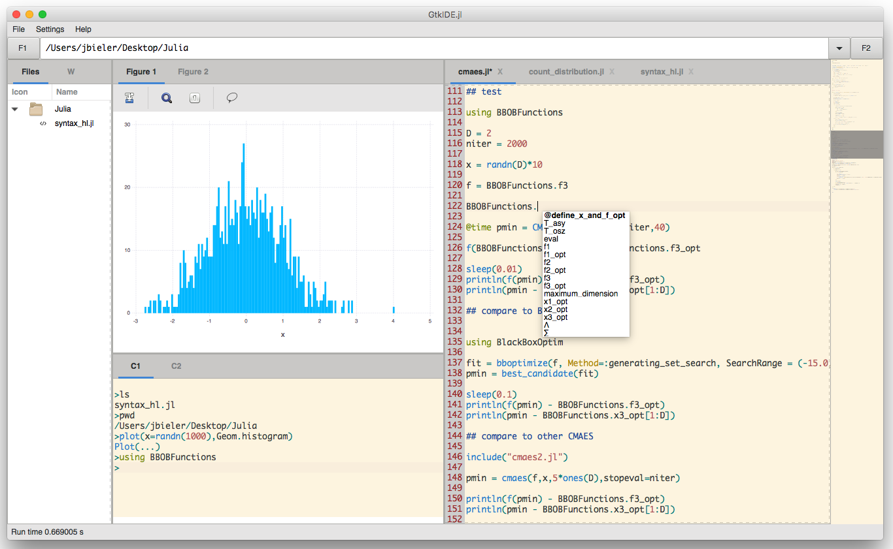

# GtkIDE.jl
GtkIDE.jl is a [Gtk-based](https://github.com/JuliaLang/Gtk.jl) IDE for [Julia](https://github.com/JuliaLang/julia) written in Julia. It includes a terminal, a plotting window and an editor.

## Installation

1. Install [GtkSourceWidget.jl](https://github.com/jonathanBieler/GtkSourceWidget.jl)

    `Pkg.clone("https://github.com/jonathanBieler/GtkSourceWidget.jl.git")`
2. Get the latest version of Immerse.jl 

    `Pkg.checkout("Immerse")`
    
3. Install the package

    `Pkg.clone("https://github.com/jonathanBieler/GtkIDE.jl.git")`
    
4. Run it

    `using GtkIDE`
    
## Usage

**Warning:** make sure to backup or commit your work before editing files, as a crash could 
wipe them out.

### Opening files

Use cd, ls, pwd to navigate in the console, and type `edit filename` to open a file. 
If `filename` does not exists it will be created instead. 

See [ConsoleCommands.jl](src/ConsoleCommands.jl) for a list of console commands.

### Running code

- `F5`: Include the current file
- `Ctrl+Return`: Run selected code, or run code between two `## ' (like Matlab's code sections).
- `Ctrl+Shift+Return`: Run selected code, or run current line.

### Shortcuts

In the editor :

- `Ctrl+Shift+D` when the cursor is above a word will show you some info on it.
- `Ctrl+Click`on a method will jump to its first definition.

- `Ctrl+s` Save file.
- `Ctrl+n` New tab.
- `Ctrl+w` Close current tab.

- `Ctrl+c` Copy.
- `Ctrl+v` Paste.
- `Ctrl+x` Cut.

- `Ctrl+k` Delete line.
- `Ctrl+d` Duplicate line.
- `Ctrl+t` Toggle comment.

- `Alt+e` Move cursor to line end.
- `Alt+a` Move cursor to line start.

- `Ctrl+z` Undo.
- `Ctrl+Shift+z` Redo.

- `Ctrl+f` Search.
- `Ctrl+a` Select all.

See [Actions.jl](src/Actions.jl) for all actions.

### Issues

- Prints and error outputs are a bit buggy.
- Random crashes.
- Too many issues to list.
